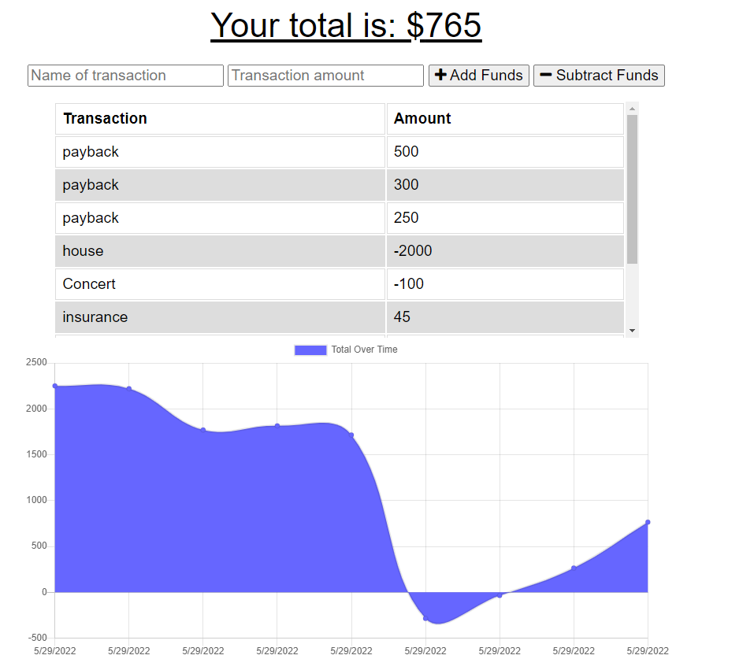
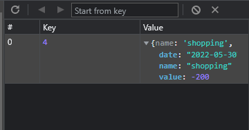
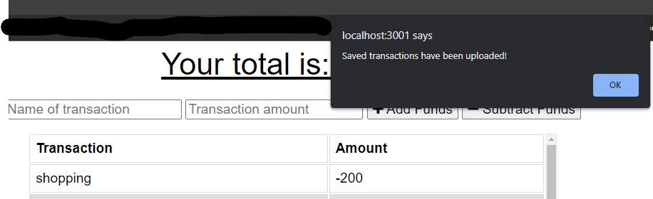

# PWA-Budget

## Table of Contents

- [Description](#description)
- [Contributors](#contributors)
- [Features](#features)
- [Installation](#installation)
- [Usage](#usage)
- [Contact Information](#contact)
- [License](#license)

## Deployed URL

https://serene-island-11384.herokuapp.com/
## Description

This is a very simple budget and expense viewer. You can add and remove funds from your budget and underneath you will see a graphical representation of your budget incomes and outgoings

 However, as the name suggests, this is also a PWA application meaning that if you go offline you can still remain connected to the page! All transactions added during periods of spotty or downed connection will be put into your browser's IndexedDB.

Then as soon as you get back online those transactions will sync with the database and you will be able to continue as though the internet wasn't even an issue.

 Thank you very much for choosing to use this app!

## Contributors

David Samuelson

## Features

- Easy to use

- Easy to install

- Offline functionality

- downloadable web-app

- Easy to read Graph and running total

- Available anywhere

## Installation

- This app is up and running on Heroku

- clone the repository to your local machine

- Run npm install

## Usage

- If you decided to download it locally just run npm start and the server will start and you can access the page at localhost:3001

- Put in a name for any transaction and the amount that transaction was, then tap the button add funds if it was money you recieved and remove funds if it was money you paid

- the graph and running total will calculate automatically

## Contact

linksn.1fan@gmail.com

GitHub: https://github.com/dsamuelson?tab=repositories

## License

Link: https://choosealicense.com/licenses/unlicense/

License Terms:
This is free and unencumbered software released into the public domain.

Anyone is free to copy, modify, publish, use, compile, sell, or
distribute this software, either in source code form or as a compiled
binary, for any purpose, commercial or non-commercial, and by any
means.

In jurisdictions that recognize copyright laws, the author or authors
of this software dedicate any and all copyright interest in the
software to the public domain. We make this dedication for the benefit
of the public at large and to the detriment of our heirs and
successors. We intend this dedication to be an overt act of
relinquishment in perpetuity of all present and future rights to this
software under copyright law.

THE SOFTWARE IS PROVIDED "AS IS", WITHOUT WARRANTY OF ANY KIND,
EXPRESS OR IMPLIED, INCLUDING BUT NOT LIMITED TO THE WARRANTIES OF
MERCHANTABILITY, FITNESS FOR A PARTICULAR PURPOSE AND NONINFRINGEMENT.
IN NO EVENT SHALL THE AUTHORS BE LIABLE FOR ANY CLAIM, DAMAGES OR
OTHER LIABILITY, WHETHER IN AN ACTION OF CONTRACT, TORT OR OTHERWISE,
ARISING FROM, OUT OF OR IN CONNECTION WITH THE SOFTWARE OR THE USE OR
OTHER DEALINGS IN THE SOFTWARE.

For more information, please refer to <https://unlicense.org>
    
